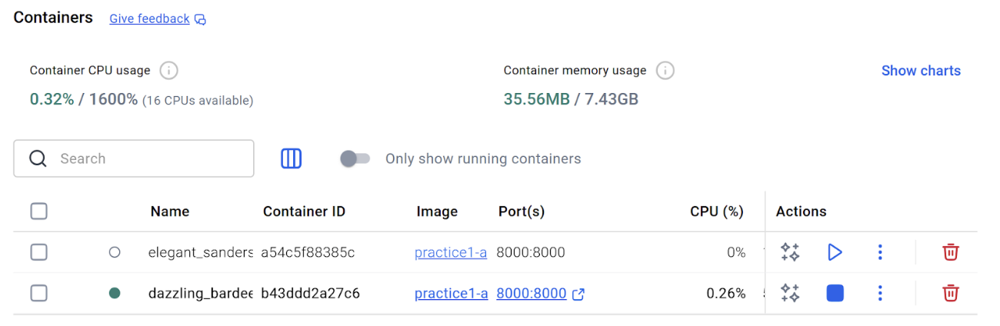
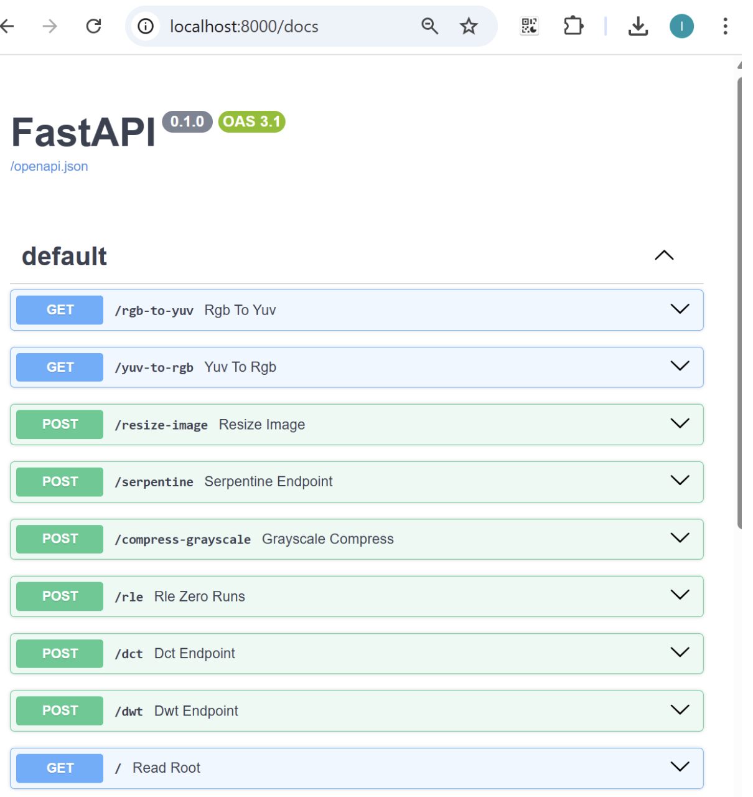
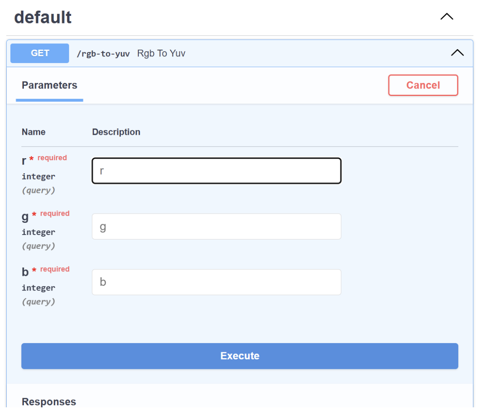
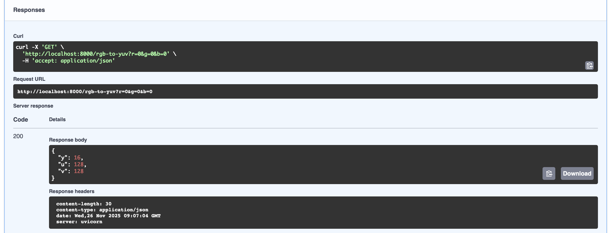

**Task 1: Create and API and put it inside a Docker**

First, we created a simple FastAPI in the file practice.py, which returns the message: Hello, Practice1!, just to check that it works correctly. 

To complete the task, we needed Docker Desktop installed and running. Docker allows us to package our API inside a container.

From the terminal, we built the Docker image as: docker build -t practice1-api .
And ran the container: docker run -p 8000:8000 practice1-api

After running the container, we opened the website http://localhost:8000 and we could see our message 

**Task 2: Put ffmpeg inside a Docker**
First, to add FFmpeg, we installed it inside the container by adding the corresponding lines to the Dockerfile in Visual Studio.
Then we rebuilt the Docker image as before and ran the container again.

We tested whether FFmpeg was correctly installed inside the running container by opening a new terminal with:
docker exec -it <container_id> bash
and checking the version with:
ffmpeg -version
We obtained the following response from the running container:

**Task 3 and 4:**
**Include all your previous work inside the new API. Use the help of any AI tool to adapt the code and the unit tests.**
**Create at least 2 endpoints which will process some actions from the previous S1**
To do so, we started by creating a new file inside the P1 folder called routes.py, and we duplicated the file first_seminar.py inside the same folder.

We imported the functions from first_seminar into the routes.py file and created FastAPI endpoints for each operation.

Next, we imported the router into the practice1 file (the main API file) to ensure that all endpoints were activated at once. After that, we rebuilt and ran the Docker container. We obtained the following active endpoints in our local host browser under /docs (http://localhost:8000/docs):

Among these endpoints, we specifically verified that the /rgb-to-yuv and /yuv-to-rgb endpoints processed correctly the actions from the previous S1 and we checked they worked correctly through API tests using FastAPI’s TestClient.

**Testing**
To ensure that the API and the original Seminar 1 functions work correctly, we created two sets of tests:
- test_api.py: We serached online how to create tests for the API endpoints we created in routes.py. This file uses FastAPI’s TestClient to simulate HTTP requests without running the server. It checks that endpoints such as /rgb-to-yuv, /yuv-to-rgb, and /rle respond with the correct status codes and return the expected JSON structure.
These tests validate that the API correctly wraps and executes the original S1 functions.

- test_seminar1.py (from S1)
Contains the original unit tests for functions from first_seminar.py.
Confirms that the core computational logic is still correct after integrating it into the new API project.

**Task 5: Docker compose**

The goal of this task was to run two different containers: an API container and a separate FFmpeg container. 

We created a docker-compose.yml that starts both services. The API is available on http://localhost:8000 and the FFmpeg is available at http://localhost:9000. Moreover, we modified our API endpoints (routes.py) so that resize and grayscale operations that used FFmpeg now reach out to the FFmpeg container we have created with HTTP requests (for example, for the resize endpoint: "http://ffmpeg-service:9000/resize"). 

Once we build the docker-compose (docker-compose up --build) we can see that both containers have been created correctly and can be seen in docker desktop.

In the api service we test the resize image to see if it resorts to the ffmpeg docker container. 

Indeed, the screenshot below confirms that the API received /resize-image and forwarded the request to the FFmpeg service, which returned OK. So the API and FFmpeg containers communicate correctly inside Docker

